# Android实验项目流程图说明

本文档提供使用Mermaid语法绘制的流程图，可在支持Mermaid的Markdown查看器中显示。

## 第一次Android实验流程图

### 1. ActionBarDemo流程图

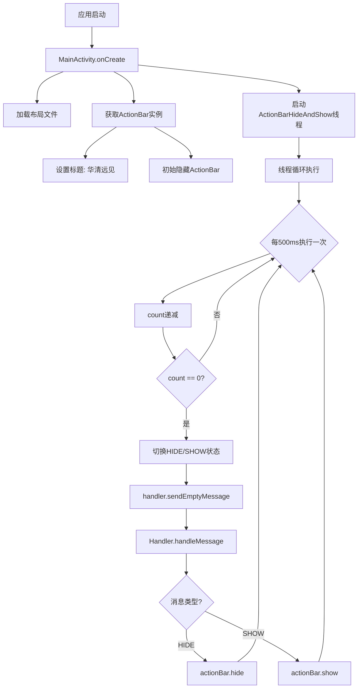

### 2. ActivityCommunication流程图

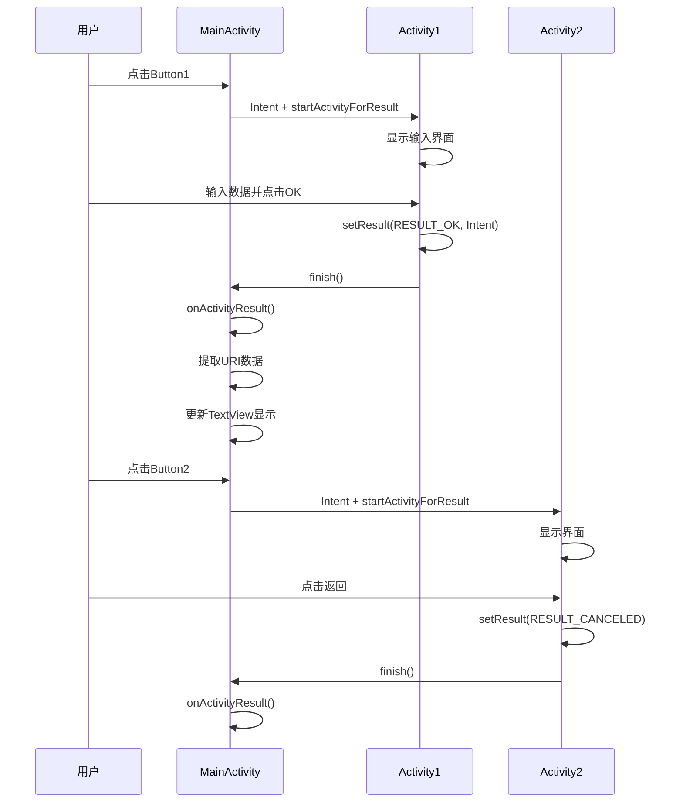

### 3. SQLiteExam2数据库操作流程图

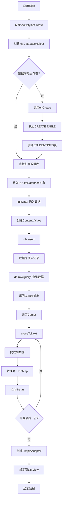

### 4. GraphicAnimation动画流程图

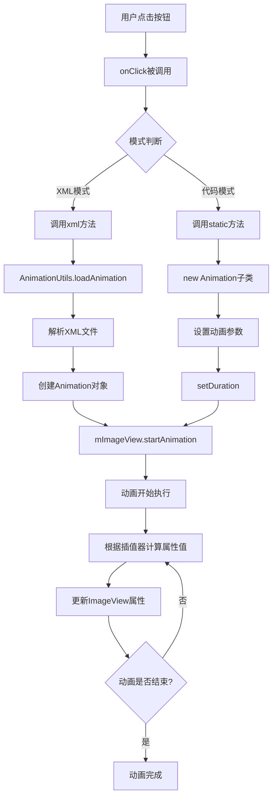

### 5. NoteApp应用流程图

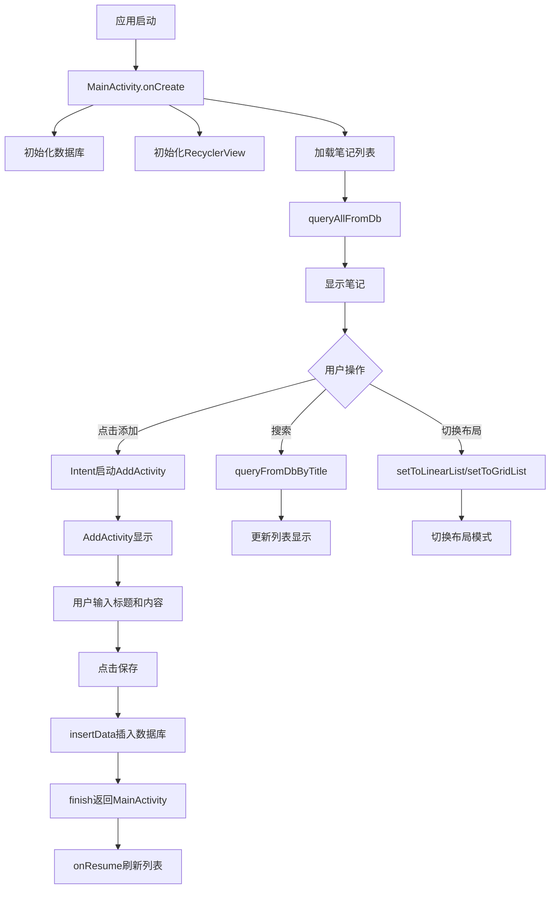

## 第二次Android实验流程图

### 1. LED灯控制流程图

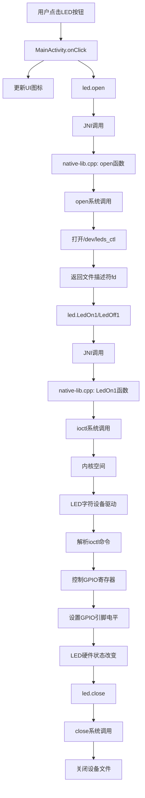

### 2. 温度采集流程图

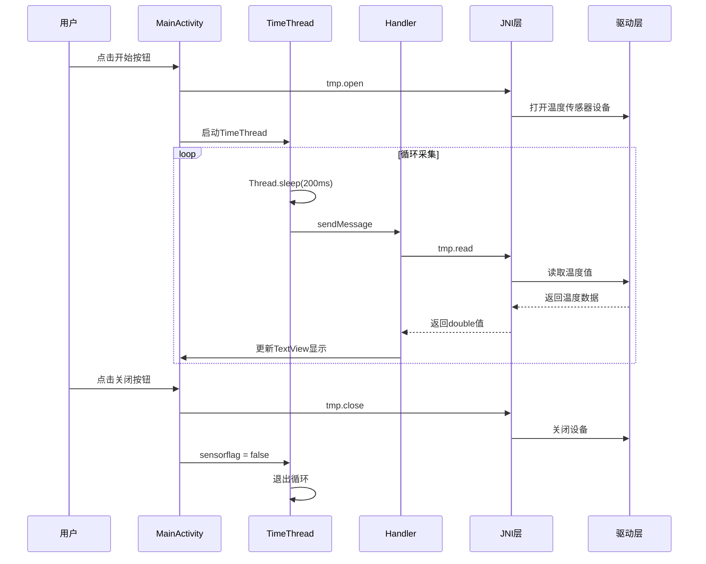

### 3. 串口通信流程图

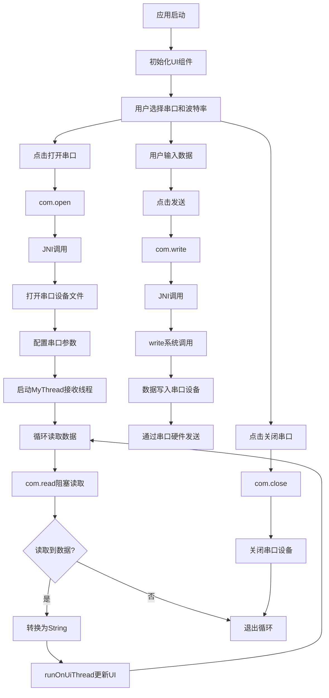

## Android与Linux驱动对比流程图

### Android方式架构

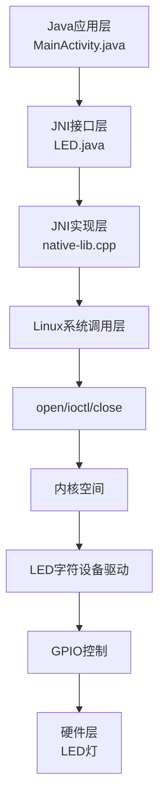

### Linux原生方式架构

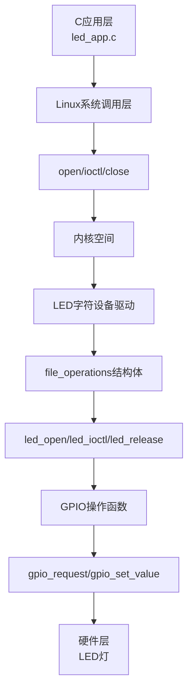

### 对比流程图

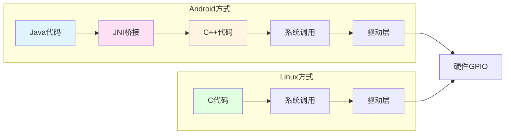

## 使用说明

这些流程图使用Mermaid语法编写，可以在以下环境中查看：

1. **GitHub/GitLab**：直接支持Mermaid渲染
2. **VS Code**：安装Mermaid Preview插件
3. **在线工具**：https://mermaid.live/
4. **Typora**：内置Mermaid支持

如果您的Markdown查看器不支持Mermaid，可以参考主报告中的文本流程图描述。

