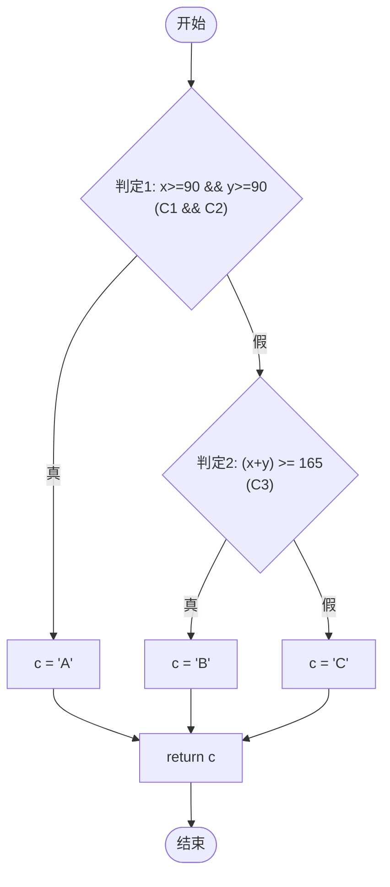

# 题目一：function1 逻辑覆盖测试

## 1. 源程序

```java
public static char function1(int x, int y) {
    char c;
    if ((x >= 90) && (y >= 90)) {      // 判定1: C1=(x>=90), C2=(y>=90)
        c = 'A';
    } else {
        if ((x + y) >= 165) {          // 判定2: C3=(x+y>=165)
            c = 'B';
        } else {
            c = 'C';
        }
    }
    return c;
}
```

## 2. 控制流图



**节点说明：**

| 节点 | 类型 | 说明 |
|------|------|------|
| N1 | 判定 | C1: x>=90, C2: y>=90 |
| N2 | 语句 | c='A' |
| N3 | 判定 | C3: (x+y)>=165 |
| N4 | 语句 | c='B' |
| N5 | 语句 | c='C' |
| N6 | 语句 | return c |

## 3. 测试用例设计

### (1) 语句覆盖

目标：每条语句至少执行一次。最少 **3** 条用例。

| 用例ID | x | y | 覆盖路径 | 预期输出 |
|--------|---|---|----------|----------|
| SC-1 | 90 | 90 | N1→N2→N6 | A |
| SC-2 | 80 | 85 | N1→N3→N4→N6 | B |
| SC-3 | 50 | 50 | N1→N3→N5→N6 | C |

### (2) 判定覆盖

目标：每个判定的真、假分支各执行一次。最少 **3** 条用例。

| 用例ID | x | y | 判定1 | 判定2 | 预期输出 |
|--------|---|---|-------|-------|----------|
| DC-1 | 90 | 90 | 真 | — | A |
| DC-2 | 80 | 85 | 假 | 真 | B |
| DC-3 | 50 | 50 | 假 | 假 | C |

### (3) 条件覆盖

目标：每个条件的真、假值各出现一次。

| 用例ID | x | y | C1 | C2 | C3 | 预期输出 |
|--------|---|---|----|----|-----|----------|
| CC-1 | 90 | 90 | T | T | — | A |
| CC-2 | 90 | 50 | T | F | F | C |
| CC-3 | 50 | 90 | F | T | F | C |
| CC-4 | 80 | 85 | F | F | T | B |
| CC-5 | 50 | 50 | F | F | F | C |

### (4) 判定-条件覆盖

目标：同时满足判定覆盖与条件覆盖。

| 用例ID | x | y | 判定1 | 判定2 | C1 | C2 | C3 | 预期输出 |
|--------|---|---|-------|-------|----|----|-----|----------|
| MCDC-1 | 90 | 90 | 真 | — | T | T | — | A |
| MCDC-2 | 90 | 50 | 假 | 假 | T | F | F | C |
| MCDC-3 | 50 | 90 | 假 | 假 | F | T | F | C |
| MCDC-4 | 80 | 85 | 假 | 真 | F | F | T | B |
| MCDC-5 | 50 | 50 | 假 | 假 | F | F | F | C |

### (5) 条件组合覆盖

目标：判定1中 C1、C2 的所有组合（4种），以及判定2中 C3 的真假（2种）。

| 用例ID | C1 | C2 | C3 | x | y | 预期输出 |
|--------|----|----|----|---|---|----------|
| Comb-1 | T | T | — | 90 | 90 | A |
| Comb-2 | T | F | F | 90 | 50 | C |
| Comb-3 | F | T | F | 50 | 90 | C |
| Comb-4 | F | F | T | 80 | 85 | B |
| Comb-5 | F | F | F | 50 | 50 | C |

### (6) 路径覆盖

程序共有 **3** 条独立路径：

| 路径 | 描述 | 用例ID | x | y | 预期输出 |
|------|------|--------|---|---|----------|
| 路径1 | 判定1真 → A | Path-1 | 90 | 90 | A |
| 路径2 | 判定1假，判定2真 → B | Path-2 | 80 | 85 | B |
| 路径3 | 判定1假，判定2假 → C | Path-3 | 50 | 50 | C |

## 4. 测试代码与执行

测试类：`Function1Test.java`

```powershell
javac whitebox\WhiteBox.java whitebox\Function1Test.java
java whitebox.Function1Test
```

请将终端运行结果截图保存，作为本题报告附件。
