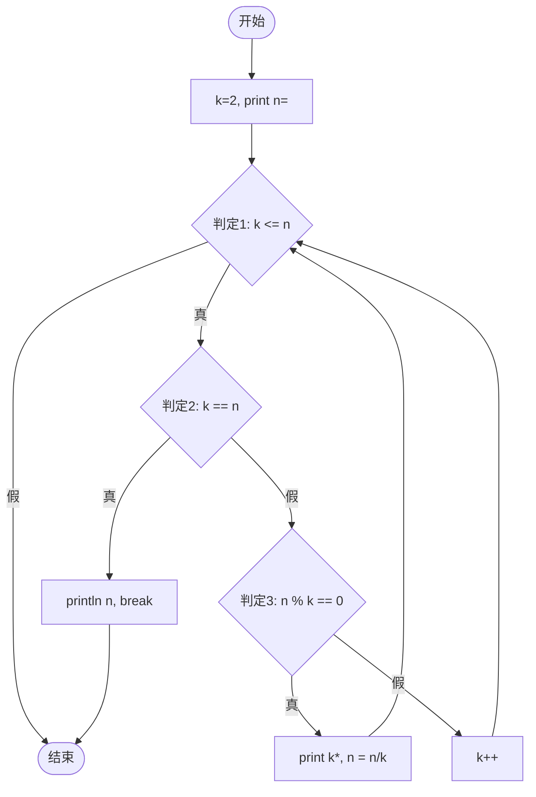

# 题目二：function2 基本路径测试

## 1. 源程序

function2 的功能是将一个正整数分解质因数。例如，输入 150，打印出 `150=2*3*5*5`。

```java
public static void function2(int n) {
    int k = 2;
    System.out.print(n + "=");
    while (k <= n) {           // 判定1
        if (k == n) {          // 判定2
            System.out.println(n);
            break;
        } else {
            if (n % k == 0) {  // 判定3
                System.out.print(k + "*");
                n = n / k;
            } else {
                k++;
            }
        }
    }
}
```

## 2. 控制流图



## 3. 环形复杂度

**方法一（判定节点数）：**  
判定节点：判定1、判定2、判定3，共 3 个  
**V(G) = 判定数 + 1 = 3 + 1 = 4**

**方法二（边-节点+2）：**  
节点数 N = 10，边数 E = 12  
**V(G) = E - N + 2 = 12 - 10 + 2 = 4**

**方法三（区域数）：**  
有界区域 3 个 + 1 = **4**

## 4. 独立测试路径

| 路径ID | 路径描述 | 测试数据 n | 预期输出 |
|--------|----------|------------|----------|
| P1 | while(k<=n) 为假，不进入循环 | 1 | 1= |
| P2 | k==n 为真，输出质数并 break | 7 | 7=7 |
| P3 | n%k==0 为真，分解因子 | 150 | 150=2*3*5*5 |
| P4 | n%k!=0 为真，执行 k++ | 9 | 9=3*3 |

## 5. 测试代码与执行

测试类：`Function2Test.java`

```powershell
javac whitebox\WhiteBox.java whitebox\Function2Test.java
java whitebox.Function2Test
```

请将终端运行结果截图保存，作为本题报告附件。
